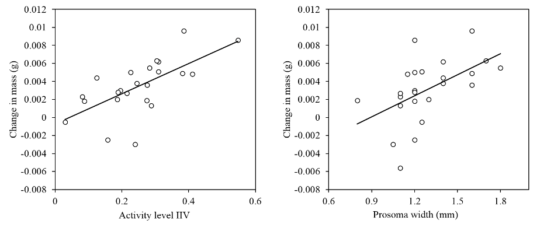

## Abstract

Animal personality, defined as consistent differences between individuals in behavior, has been the subject of hundreds if not thousands of papers. However, little work explores the fitness consequences of variation in behavior within individuals, or intraindividual variability (IIV). We probe the effects of behavioral IIV on predator-prey interaction outcomes in beach-dwelling jumping spiders (Terralonus californicus). Prior studies have found that spiders with higher body condition (body mass relative to size) behave more variably. Thus, we hypothesized that jumping spider activity level IIV would relate positively to foraging performance. To address this, we tested for associations between activity IIV, average activity level, and two measures of foraging success in laboratory mesocosms: change in spider mass and the number of prey killed. Activity IIV positively correlated with the mass that spiders gained from prey, but not with the number of prey killed. This suggests that spiders with high IIV consumed a greater proportion of their prey or used less energy. Interestingly, average activity level (personality) predicted neither metric of foraging success, indicating that behavioral IIV can predict metrics of success that personality does not. Therefore, our findings suggest that IIV should be considered alongside personality in studies of predator-prey interactions.
