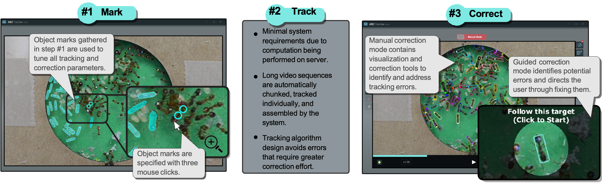

## Abstract

Visual multi-object tracking has the potential to accelerate many forms of quantitative analyses, especially in research communities investigating the motion, behavior, or
social interactions within groups of animals. Despite its
potential for increasing analysis throughput, complications
related to accessibility, adaptability, accuracy, or scalable
application arise with existing tracking systems. Several iterations of prototyping and testing have led us to a multiobject tracking system – ABCTracker – that is: accessible
in both system as well as technical knowledge requirements,
easily adaptable to new videos, and capable of producing
accurate tracking data through a mixture of automatic and
semi-automatic tracking features.