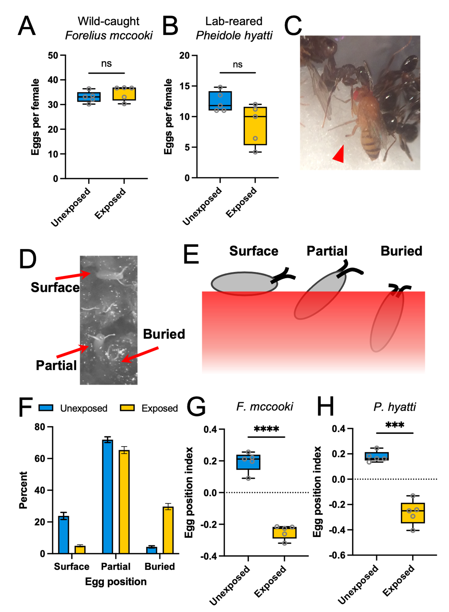

## Abstract

Ants are ubiquitous and consume insects at all life stages, presumably creating a strong selective pressure for ant avoidance behaviors across insects. The insect egg stage can be especially defenseless against predation given that eggs are usually immobile and unguarded, suggesting insect mothers may have evolved oviposition strategies to minimize the ant predation risk to their offspring. Given the lack of parental care in most insects, these oviposition strategies would likely be innate rather than learned, since insect mothers are not usually present to assess predation of their eggs. Here, we use the vinegar fly Drosophila melanogaster as a model system for examining parental defensive responses to ant presence. Flies usually lay eggs partially inserted into the food substrate, although some are laid on top of the food and a few are inserted deeply into the food. We found that exposure to ants significantly alters fly oviposition depth: the proportion of eggs on the food surface decreased while the proportion of buried eggs increased. Buried eggs survive ant foraging bouts better than surface eggs, showing that this oviposition depth behavior is adaptive. This induced behavior is conserved across the genus Drosophila and is dependent on the fly olfactory system: anosmic mutant flies fail to bury their eggs in the presence of ants, and ant odor extracts are sufficient to induce egg burying. To further delineate the ant lineages to which flies respond, we exposed flies to the odors from numerous species of ants and other insects. Surprisingly, flies buried their eggs in response to the odors of nearly all hymenopterans tested, including hymenopteran groups that flies rarely interact with in nature like bees and paper wasps. Our data suggest that hymenopterans possess a conserved and ancient odorant, and that drosophilids evolved a mechanism for sensing this odorant early in their evolution as a means of protecting their offspring from ant predation. This study sheds light on the ecology and mechanisms underlying a common biotic interaction in nature, that between insect parents and the ants that would consume their offspring.
