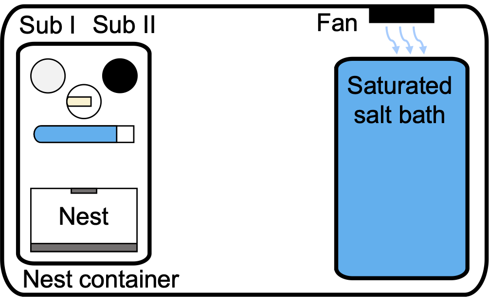

## Abstract 

Animal architectures are interesting biological phenomena that can greatly increase the fitness of the builder and exist in a variety of forms and functions across taxa. Among the most intricate architectures are social insect nests, which may have several functions, one of which is the control of internal microclimate. In social insects, the regulation particularly of humidity in the nest can be crucial for the survival and growth of the brood. Though much is known on how nest excavating social insects respond to environmental humidity, little is known about how ants that build on to pre-existing cavities respond. Here we use the rock ant Temnothorax rugatulus to determine whether and how colonies respond to environmental humidity by building and changing their nest architectures in pre-existing nest spaces. We specifically test the hypothesis that T. rugatulus colonies build different nest walls, e.g. wider or denser ones, in response to lower environmental humidity. We allowed T. rugatulus colonies to build nest walls with two substrates across a 0-100% relative humidity gradient. We further compare the porosity - empty volume in built nest walls - of natural T. rugatulus nest walls with these artificial building substrates and the substrate compositions of built walls from our experiment. We found that humidity did not influence the nest walls T. rugatulus colonies built in our experiment, concluding that regulating humidity is likely not a key function of T. rugatulus nest wall architecture. We also found that the porosities of the artificial substrate that was predominantly used by the ants in our experiment were like the porosity of natural T. rugatulus nest walls, indicating that ants had constant preferences for particular substrates. Physical nest wall features, including porosity, are therefore unlikely to be flexibly regulated in response to external humidity, but may be adaptations in other ways.