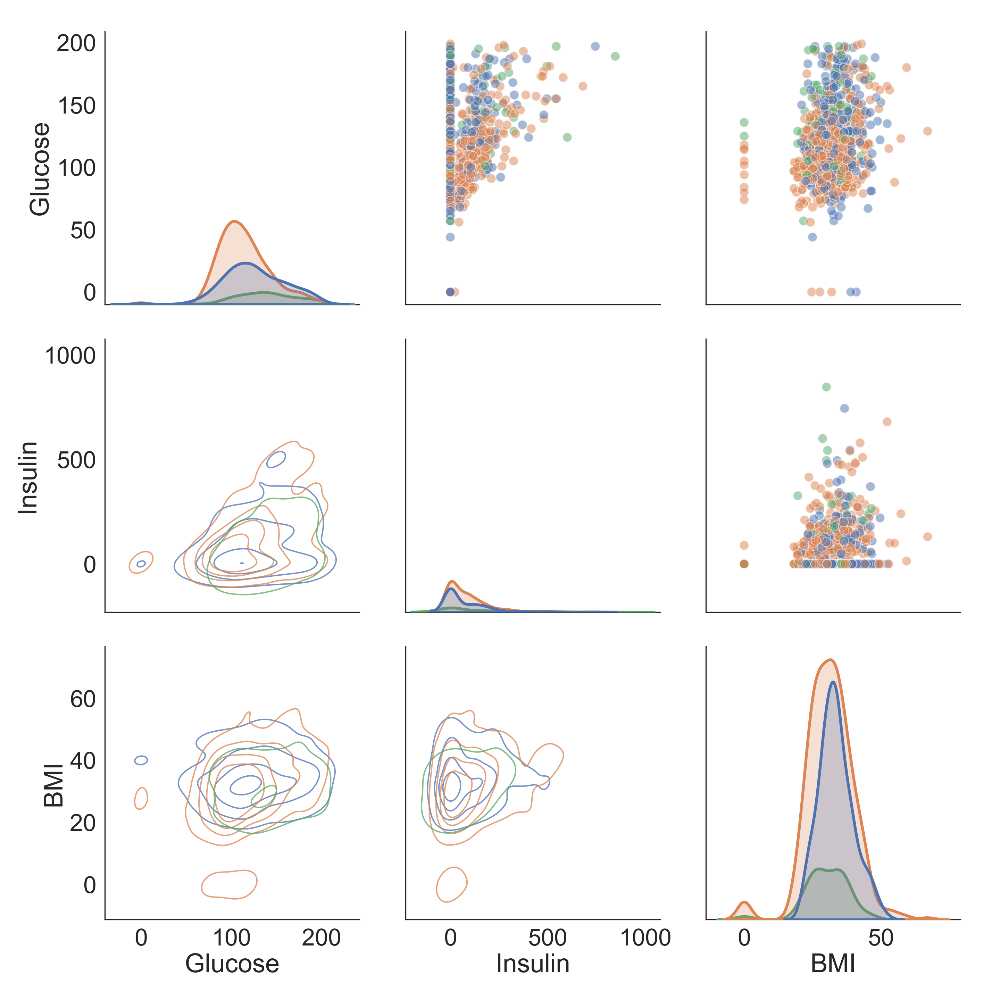

Exploratory data analysis is an essential first step towards determining the validity of your data and should be performed throughout the data pipeline. However, EDA is often performed too late or not at all. The Python programming language, is a widely used open source platform for data analysis and data visualization. This is because of the variety of libraries available and attentive community devoted to data analysis.

Here, I utilize the pandas and pandas-profiling libraries to conduct preliminary exploratory data analysis aimed at diagnosing any major issues with an imported data set. pandas and pandas-profiling offers a clean and straightforward methodology to uncover issues such as data outliers, missing data, as well as summary statistical reports.
