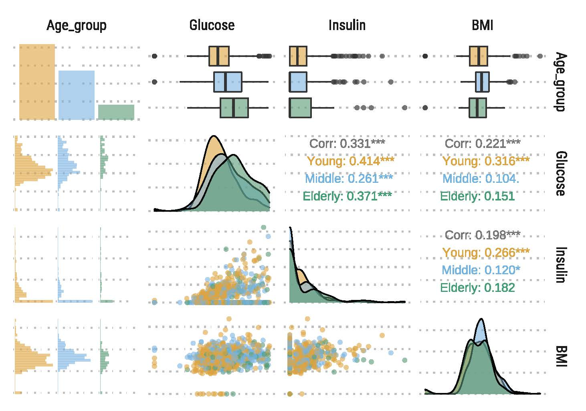

Exploratory data analysis is an essential first step towards determining the validity of your data and should be performed throughout the data pipeline. However, EDA is often performed too late or not at all. The R programming language, specifically through the RStudio IDE, is widely used open source platform for data analysis and data visualization. This is because of the extensive variety of packages available and attentive community devoted to data analysis. Consequently, there are several exploratory data analysis packages, each of which have their own pros and cons.

In this workshop series, I utilize the `dlookr` package to conduct preliminary exploratory data analysis aimed at diagnosing any major issues with an imported data set. `dlookr` offers a clean and straightforward methodology to uncover issues such as data outliers, missing data, as well as summary statistical reports.
