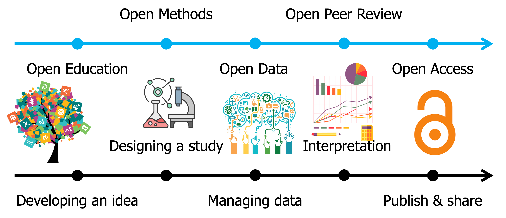

## Open Science

## Research project

Visualization of how open science concepts were related to a research project

------------------------------------------------------------------------

The [KEYS internship](https://keys.arizona.edu/) provides a unique opportunity for Arizona high school students with a strong interest in biology, engineering, environmental health, data science and biostatistics to work with top University of Arizona faculty on research projects that address the world's greatest challenges.

Each year the Data Science Institute educates KEYS interns on Open Science and Machine Learning. This year, I developed an interactive curriculum that focuses on the students rather than being purely instructional. In this, the students related every open science and machine learning concept to a novel research question that they devised. The result was a deeper understanding of each topic, because learning was tailored to each individual instead of a one-size-fits-all approach.
